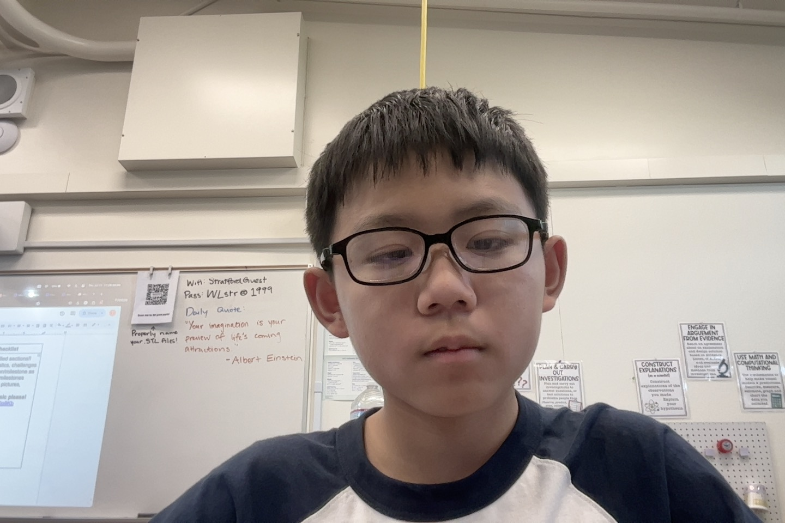

# Junxi's Robotic Arm
This is my 3-joint robotic arm, an arm with 4 servos. In short, 3 servos move the claw and one opens the claw. 


<!--- This is an HTML comment in Markdown -->
<!--- Anything between these symbols will not render on the published site -->

| **Engineer** | **School** | **Area of Interest** | **Grade** |
|:--:|:--:|:--:|:--:|
| Junxi L | Shanghai American School | Design and 3D Modelling | Incoming Freshman


  
<!--- Final Milestone

**Don't forget to replace the text below with the embedding for your milestone video. Go to Youtube, click Share -> Embed, and copy and paste the code to replace what's below.**


For your final milestone, explain the outcome of your project. Key details to include are:
- What you've accomplished since your previous milestone
- What your biggest challenges and triumphs were at BSE
- A summary of key topics you learned about
- What you hope to learn in the future after everything you've learned at BSE-->


# Second Milestone


<iframe width="560" height="315" src="https://www.youtube.com/embed/TGeD-Y4U4Dk?si=ZcI295sEnxb9hgTY" title="YouTube video player" frameborder="0" allow="accelerometer; autoplay; clipboard-write; encrypted-media; gyroscope; picture-in-picture; web-share" referrerpolicy="strict-origin-when-cross-origin" allowfullscreen></iframe>

The second milestone taught me how to control servos with computer programs, how to write code to make servos move in parallel and series, and even though it was rather an intermediate step in the project, I still learnt how to make servos move in parallel, which would help me in numerous ways when the joysticks were implemented. Most of the challenges came from faulty claw servos, which when replaced, solved a lot of problems with the arm. I now could grab items with the arm and control all 4 servos at once. I identified this problem when I was testing my servos, and the claw servo began to twich uncontrollably. I seeked help from the instructors, and they let me replace the faulty servos. After that, no servo issues happened again. I thought my next milestone will be a challenge, as the code from the repository in Github was terrible, so i probably would have to code my own.

# First Milestone

<iframe width="560" height="315" src="https://www.youtube.com/embed/57i3TMyWw34?si=oYX_4vaOnegvXHNz" title="YouTube video player" frameborder="0" allow="accelerometer; autoplay; clipboard-write; encrypted-media; gyroscope; picture-in-picture; web-share" referrerpolicy="strict-origin-when-cross-origin" allowfullscreen></iframe>


My first milestone was to assemble everything according to the instructions. 
First of all, I assembled the base, the Nano Shield and the bottom servo.
Next, I connected a 7.5 Volt power supply to the system because Lithium Ion Batteries were not allowed.
I assembled the two arms on July 3rd.
I completed the assembly by July 5th.
Some of the greatest challenges were because the instructions were mostly in black and white, I confused the SG90 arm with the MG90 arm, which didn't fit, forcing me to dissasemble half the structure. Halfway through the process, I had to test my servos, but luckily I had to dissasemble nothing. Finally, because of my bad habit of splitting wires, the wiring to the joystick was a mess, and I had to find other Female-Female wires. I also learned how to un-split wires, by heat welding them together.

# Schematics 

Here's where you'll put images of your schematics. [Tinkercad](https://www.tinkercad.com/blog/official-guide-to-tinkercad-circuits) and [Fritzing](https://fritzing.org/learning/) are both great resoruces to create professional schematic diagrams, though BSE recommends Tinkercad becuase it can be done easily and for free in the browser. 

# Code
Here's where you'll put your code. The syntax below places it into a block of code. Follow the guide [here]([url](https://www.markdownguide.org/extended-syntax/)) to learn how to customize it to your project needs. 

```c++
void setup() {
  
  Serial.begin(9600);
  
}

void loop() {
  // put your main code here, to run repeatedly:

}
```

# Bill of Materials

<!---Here's where you'll list the parts in your project. To add more rows, just copy and paste the example rows below.
Don't forget to place the link of where to buy each component inside the quotation marks in the corresponding row after href =. Follow the guide [here]([url](https://www.markdownguide.org/extended-syntax/)) to learn how to customize this to your project needs. -->

| **Part** | **Note** | **Price** | **Link** |
|:--:|:--:|:--:|:--:|
| COKINO 3-Joint Arm Kit | Assembling the entire structure | $Price | <a href="https://www.amazon.com/Arduino-A000066-ARDUINO-UNO-R3/dp/B008GRTSV6/"> Link </a> |


# Other Resources/Examples
<!---One of the best parts about Github is that you can view how other people set up their own work. Here are some past BSE portfolios that are awesome examples. You can view how they set up their portfolio, and you can view their index.md files to understand how they implemented different portfolio components.-->
- [Example 1](https://trashytuber.github.io/YimingJiaBlueStamp/)
- [Example 2](https://sviatil0.github.io/Sviatoslav_BSE/)
- [Example 3](https://arneshkumar.github.io/arneshbluestamp/)

To watch the BSE tutorial on how to create a portfolio, click here.

# Starter Project

<iframe width="560" height="315" src="https://www.youtube.com/embed/qq7vNRPoHok?si=HxcI6-ftf1u9OHy5" title="YouTube video player" frameborder="0" allow="accelerometer; autoplay; clipboard-write; encrypted-media; gyroscope; picture-in-picture; web-share" referrerpolicy="strict-origin-when-cross-origin" allowfullscreen></iframe>

The starter project was a device in which I could control the color of a light through 3 sliders, expressing an intensity of the LED between 0 and 255, which controlled the color of one of the 3 colored LEDs on the light above. I learned how to solder responsibly with my starter project. Some the challenges were levelling the entire sliders to avoid any uneveness. The exact mechanics involve a power supply, 3 variable resistors connected to sliders, and a tri-color LED, a LED with three LEDs inside, each LED different colors, being red, green and blue. The result is, by adjusting the sliders, we can edit the color of the TCLED to any color on the RGB scale simple by adjusting how much power goes to each LED.
